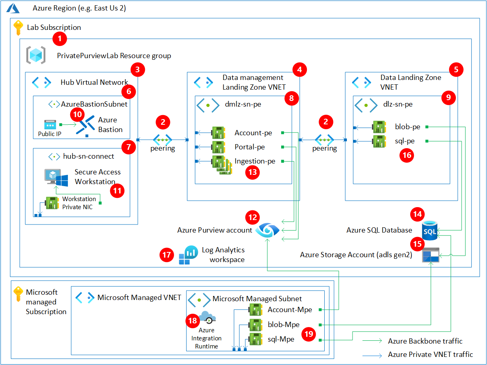

# Environment description and architecture

## Overview

The goal here is to simulate a bare bone environment that approximates the main components you would find in deployments that follow the [Cloud Adoption framework](https://docs.microsoft.com/azure/cloud-adoption-framework/) and require a private access. For the sake of learning and exposure to more restrictive guidelines. To that end, the following area of interest are included in the architecture:

- Simulating a hub and spoke network that includes a Hub virtual network, a Data management Landing zone virtual network and a Data Landing zone virtual network.
- The above three virtual network will be peered to simulate a typical deployment
- All deployed services will make use of private endpoints
- The Purview service will be using the Managed VNET feature to scan the data source using private network traffic
- Simulating a fully private "secure access workstation" involving spinning up a virtual machine that is fully private (i.e. not accessible from the internet)
- Leveraging the Azure Bastion Service to handle the public facing handshake.
- [Optional] Enable a feature of Azure Cloud Defender called Just in time access to limit the attack surface of the Virtual machine.

This will simulate the most stringent of standards that you may encounter in the field and how Azure can address those requirements.

## Architecture diagram

| Architecture element  | Description |
| ------------- | ------------- |
| 1- Subscription and Resource group  | This lab recommends to create one resource group to hold all our elements for easy of deployment and cleaning up  |
| 2- Virtual network peerings  | This lab will attempt to simulate a real network setup that you would encounter in the field. Thus we are creating three virtual network to simulate three distinct subscription. We are peering all three of them to simulate a data mesh architecture |
| 3- The hub Virtual networks | This VNET represent the traditional "connectivity" subscription in the Cloud Adoption Framework. This is the VNET where we expect to find the interconnect with a customer's on-premise infrastructure. For the purposes of this lab, this is where we will simulate connectivity from the outside into our purview environment. |
| 4- The Data Management Landing Zone VNET | This VNET represent the central Landing zone where we'd house centralized data services that would typically have a 1-1 relationship with a Tenant. Azure Purview is one such service and we recommend to put it in its own subscription. For this lab though, we are using a dedicated VNET to simulate such a scenario |
| 5 - The data landing zone VNET| This will simulate a Data landing zone, one of the many "spokes" in a customer data mesh. Of course this network is also peered with the other two and we will house data services in it. For this lab, we will use an instance of Azure Data Lake Gen2 and one Azure SQL database |
| 6 - The AzureBastionSubnet| This is a special subnet that has to be called "AzureBastionSubnet". It will be used to host our Azure Bastion Service that will allow us to securely and privately connect to our lab from the outside |
| 7 - The hub-sn-connect subnet | This subnet is meant to represent the "connectivity" subnet where we would host the Secure Access workstations that will let us securely connect to the environment |
| 8 - The DMLZ-sn-pe subnet| This subnet is built to host all the private endpoints for our Data Management Landing Zone PaaS services that will be used in the scenario. For this lab, only Azure Purview will be used for this Subnet. Please read on in Module01 for more insight as to the nature of Private EndPoints. |
| 9 - The DLZ-sn-pe Subnet | This subnet is built to host all the private endpoints for our Data Landing Zone PaaS services that will be used in the scenario. For this lab one instance of Azure SQL Database and Azure Data Lake Gen2 |

